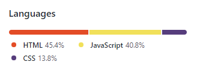

# Schedule Maker
This is a day planner application. It tracks the date and time and lets the user now what they should be currently doing and what future activities are planned.  

## Table of Contents
* Description
* Technologies
* Link To Deployed Website
* Acknowledgments

## Description
Upon opening the screen the user is shown the current date and time. Below they are given a series of boxes for which they can enter text to effectively schedule their work day. The interface color codes the times of day to show what has been done, what should currently be worked on and what needs to be done in future hours. White being in the past, red for the current time and green for future activities. 
See below: 

The save button shown to the right of each line (🔒) allows the scheduler to save that individual line entry for later use. The saved entries will be repopulated when the page loads.  

## Technologies
The technologies used and what percetages each was used is listed below.

## Link to Deployed Website 
Schedule your day here!
https://hoffalypse.github.io/Schedule-Maker/

## Acknowledgments
Andres Jimenez (Tudor)  
Kirtley Adams (Teaching Assistant)  
Dan Kaltenbaugh (Instructor) 
George Yoo (Teaching Assisstant)